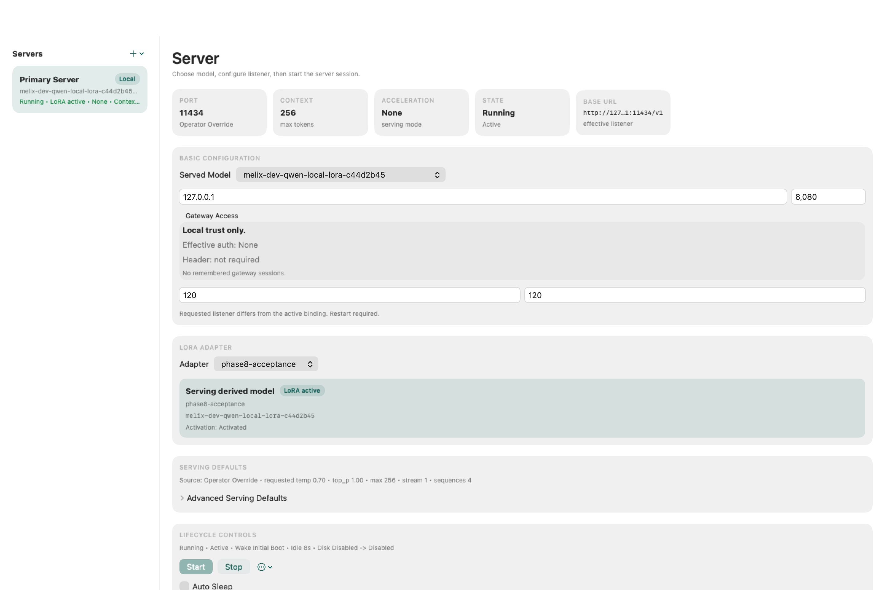

<p align="center">
  
</p>

<h2 align="center">Your Mac. Your Models. Your Rules.</h2>

<p align="center">
  A native local AI workspace for Apple Silicon — run, fine-tune, and benchmark language models<br>
  entirely on your own machine, with no data leaving your desk.
</p>

<p align="center">
  <a href="https://github.com/Keith-CY/melix/actions/workflows/release-gates.yml"></a>
  <a href="https://github.com/Keith-CY/melix/actions/workflows/package-self-contained-app.yml?query=event%3Aschedule+branch%3Amain"></a>
  
  
  
  <a href="LICENSE"></a>
</p>

---

## What Is Melix?

Melix is a complete local AI operations platform built for Apple Silicon Macs. It brings together everything you need to work with language models — serving, fine-tuning, benchmarking, and evaluation — in a single native app and CLI, with no subscriptions, no cloud dependencies, and no data leaving your machine.

Think of it as a local AI studio: a place where you can load a model, adapt it to your needs, measure its quality, and compare results — all from your own hardware.

<p align="center">
  
</p>

---

## What You Can Do With Melix

| Capability | What It Means For You |
|---|---|
| **Model Registry** | Import models from disk or download from Hugging Face into a local registry you control |
| **Server Sessions** | Start, pause, resume, and stop local model servers with a single command or click |
| **Local Chat** | Chat with any registered model from the menubar app or CLI, staying fully offline |
| **LoRA Fine-Tuning** | Train a custom adapter on your own dataset to specialize a model for your use case |
| **Benchmarking** | Run repeatable quality benchmarks and matrix comparisons across models and adapters |
| **Evaluation** | Score models against standard suites (MMLU and more) and export the results |
| **Native macOS App** | A polished menubar and workspace UI that puts all of the above one click away |

## Why Melix?

Local AI work tends to scatter across too many tools: one script for serving, another for training, a notebook for evaluation, and a shell history for benchmarks. Melix keeps that entire loop in one place, on one machine.

- **Privacy by default.** Your models, your data, your results — none of it leaves your Mac.
- **No subscriptions.** Run any compatible model as many times as you like at zero marginal cost.
- **Repeatable science.** Benchmark and evaluation results are stored in a repository-owned format so comparisons stay honest over time.
- **Operator-grade UI.** The native macOS workspace is a first-class citizen, not an afterthought.

## Who Is Melix For?

- **AI practitioners on Apple Silicon** who want a local runtime instead of a remote-only workflow
- **Model engineers** who need a repeatable loop for LoRA fine-tuning, comparison, and evaluation
- **Privacy-conscious builders** who want full control over inference without cloud APIs
- **Local AI enthusiasts** who want a polished native macOS experience alongside the CLI
- **Contributors** who care about typed protocols, reproducible runbooks, and productized local tooling

---

## Quick Start

Make sure you have **macOS 15+** on **Apple Silicon**, plus `swift`, `python3`, and [`uv`](https://docs.astral.sh/uv/) installed.

```bash
# 1. Bootstrap the repository
make bootstrap

# 2. Generate protocol artifacts
make proto

# 3. Run verification gates
make swift-test
make py-test
make integration-test
```

Then bring up the local stack:

```bash
bash scripts/dev_up.sh
```

For the full native macOS experience:

```bash
bash scripts/dev_app_up.sh
```

**New here?** The [Getting Started guide](docs/getting-started.md) walks through every step with context.

---

## Documentation

| Document | What's Inside |
|---|---|
| [Getting Started](docs/getting-started.md) | Step-by-step setup from a fresh checkout to a working loop |
| [Current Status](docs/current-status.md) | What is shipped today and where the honest boundaries are |
| [Phase Roadmap](docs/phase-roadmap.md) | The original phase model and its current completion state |
| [Contributing](docs/contributing.md) | How to contribute, what to verify, and what a good PR looks like |
| [Docs Map](docs/README.md) | Full index of specs, runbooks, architecture decisions, and plans |
| [Marketing & Storytelling Kit](docs/marketing/README.md) | Product overview, LoRA narrative, reusable copy, and screenshot evidence |
| [Benchmark & LoRA Runbook](docs/runbooks/benchmark-matrix-evaluation-and-lora.md) | Deep-dive operator guide for benchmarking and fine-tuning |
| [Local Install Runbook](docs/runbooks/phase-8-local-install.md) | Install Melix as a persistent local service |
| [Packaging Targets](docs/runbooks/platform-packaging-targets.md) | Homebrew, launch agent, and app-bundle delivery options |

---

## Contributing

Contributions are welcome — documentation, tooling, protocol, runtime, CLI, and macOS operator surface. Start with [docs/contributing.md](docs/contributing.md) for the workflow, verification commands, and handoff expectations.

The short version:
1. Branch from `main`.
2. Keep the change small and focused on one behavior slice.
3. Update the relevant spec or runbook if behavior changes.
4. Run `make swift-test && make py-test && make integration-test` before opening a PR.

---

## License

Melix is licensed under the **Apache License, Version 2.0**. See [LICENSE](LICENSE).
